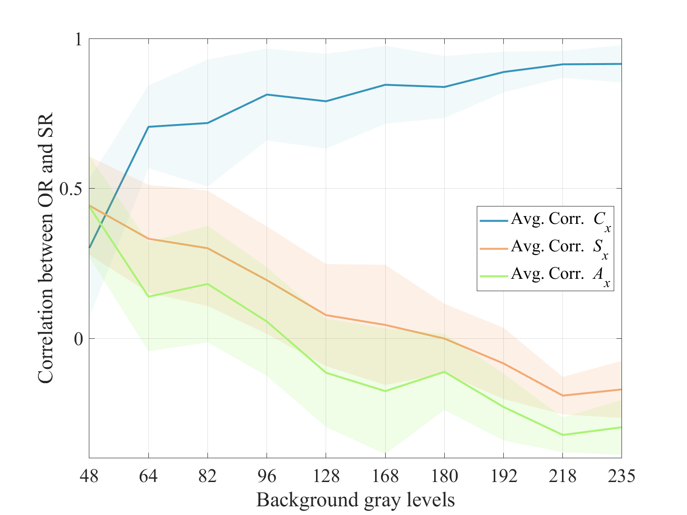

# **Human Perceptive Mura Index (HPMI)**

##### This is the official MATLAB implementation code of the human perceptive Mura index in [link]()
***
Mura is a panel defect, i.e., an uneven or irregular region on a display panel, which occurs because of impurities or malfunction of machinery during panel manufacturing.
This work proposes a new quantitative Mura evaluation metric that can measure the severity of Mura defects in the panel display.
This work is now in revision at Measurement [link](https://www.sciencedirect.com/journal/measurement)

### Correlation between subjective rankings and human perceptive features

  

### Convolutional autoencoder and variational autoencoder
We used three background estimation methods: polynomial regression, convolutional autoencoder, and variational autoencoder.
You can check the detailed architectures of [CAE](TF/Convolutional_autoencoder_architecture.png) and [VAE](Variantional_autoencoder_architecture.png) in our Tensorflow [code](TF)

### Citation
